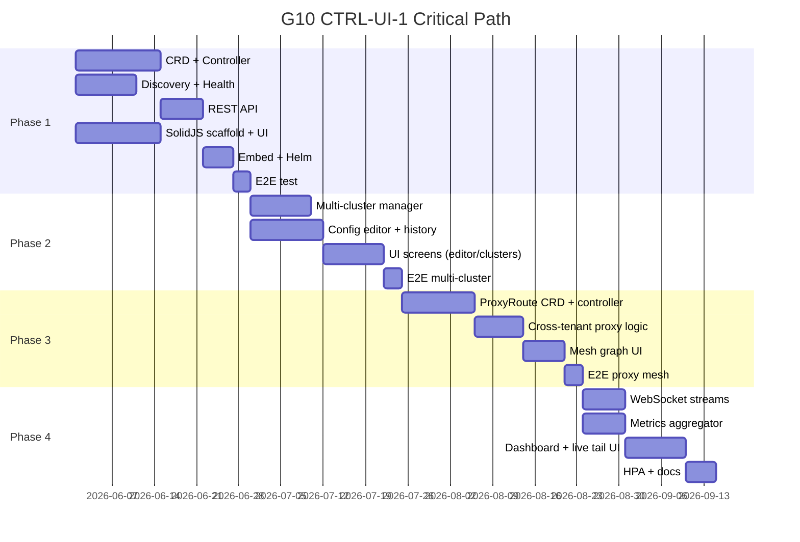

# G10 CTRL-UI-1 — Detailed Delivery Plan

> Management UI and multi-instance control plane.
> Parent design: [DESIGN.md § G10](../DESIGN.md#g10-ctrl-ui-1--management-ui-and-multi-instance-control-plane)

---

## Overview

This document breaks the G10 delivery into four phases with concrete
tasks, deliverables, dependencies, and acceptance criteria. Each phase
produces a shippable increment.

---

## Phase 1: Foundation (Instance CRUD + Discovery + Basic UI)

**Goal:** Operators can create/list/delete lwauth instances via API or
UI; existing instances are auto-discovered.

| # | Task | Deliverable | Depends on | Acceptance |
|---|------|-------------|------------|------------|
| 1.1 | `LwauthInstance` CRD schema | `api/crd/v1alpha1/lwauthinstance_types.go` + generated deepcopy/client | M4 controller pattern | `kubectl apply` validates; status subresource works |
| 1.2 | Instance controller (reconciler) | `internal/controller/lwauthinstance.go` — reconciles CRD → Deployment + Service + AuthConfig + PDB + NetworkPolicy | 1.1 | Create CRD → Pods running within 30s; delete CRD → resources cleaned up |
| 1.3 | Label-selector discovery | `internal/controlplane/discovery/kubernetes.go` — watches Services with `app.kubernetes.io/name=lwauth`, probes `/v1/admin/status` | M9 admin API | Existing lwauth instances appear in registry without manual action |
| 1.4 | Manual registration endpoint | `POST /v1/controlplane/instances/register` — accepts name, cluster, adminUrl, TLS config | 1.6 | External/VM instances health-checked on same interval as auto-discovered |
| 1.5 | Health checker | `internal/controlplane/health/checker.go` — periodic probe loop for all registered instances | 1.3, 1.4 | Unhealthy instances marked within 2× check interval; status exposed on CRD |
| 1.6 | REST API scaffold | `internal/controlplane/api/` — chi/stdlib router, admin JWT + mTLS middleware, CRUD handlers for instances | C3 admin-auth | All endpoints return structured JSON; 401 on missing/invalid creds |
| 1.7 | `cmd/lwauth-controlplane` entrypoint | `cmd/lwauth-controlplane/main.go` — wires controller-runtime manager + HTTP server + discovery | 1.1–1.6 | Binary builds, starts, serves API on `:8443` |
| 1.8 | SolidJS project scaffold | `ui/console/` — Vite + SolidJS 2.x + TypeScript + TailwindCSS + `@solidjs/router` | — | `npm run build` produces `dist/` < 200 KB gzipped |
| 1.9 | UI: Instance list screen | Table with name, cluster, status, replicas, config version, uptime | 1.6, 1.8 | Lists all instances; auto-refreshes on WebSocket event |
| 1.10 | UI: Create instance dialog | Form → `POST /v1/controlplane/instances` | 1.9 | Validates inputs; instance appears in list within 30s |
| 1.11 | UI: Instance health detail | Per-instance view: Pod status, last reconcile, config SHA, admin-status response | 1.9 | Shows real-time data; badges for degraded/unhealthy |
| 1.12 | Embed UI in binary | `embed.FS` in `cmd/lwauth-controlplane`; serves at `/` with CSP headers | 1.8–1.11 | Single binary serves both API and UI; no external static host |
| 1.13 | Helm sub-chart | `deploy/helm/lightweightauth-controlplane/` — Deployment, Service, RBAC, ConfigMap | 1.7 | `helm install` produces working control-plane Pod with correct RBAC |
| 1.14 | E2E test | `tests/e2e/controlplane_phase1_test.go` — Kind cluster, create instance via API, verify Pods | all above | Green in CI; exercises create → discover → health → delete |

**Exit criteria:** Operator installs control plane via Helm; existing
lwauth instances appear automatically; new instances can be created from
the UI without `kubectl`.

---

## Phase 2: Config Management + Multi-Cluster

**Goal:** Operators edit AuthConfig visually, track history, rollback,
and manage instances across multiple clusters.

| # | Task | Deliverable | Depends on | Acceptance |
|---|------|-------------|------------|------------|
| 2.1 | Multi-cluster manager | `internal/controlplane/multicluster/manager.go` — parses `clusters:` config, spawns per-cluster controller-runtime manager | Phase 1 | Control plane watches CRDs in N clusters simultaneously |
| 2.2 | Cluster registration API | `GET/POST/DELETE /v1/controlplane/clusters` | 1.6 | Add remote cluster → its instances appear in discovery |
| 2.3 | Kubeconfig + SA token support | Accept kubeconfig file path or raw `{apiServer, token, caBundle}` | 2.1 | Both modes work; token refresh handled for expiring SAs |
| 2.4 | Config push (AuthConfig write) | `POST /instances/{cluster}/{name}/config` — validates via `internal/config.Compile`, writes AuthConfig CRD | 1.2 | Invalid config returns 422 with structured errors; valid config applied within configstream interval |
| 2.5 | Config version history | Annotation-based changelog on AuthConfig CRD (`lwauth.io/history: [...]`) or dedicated ConfigMap | 2.4 | `GET .../config/history` returns ordered list of versions with timestamps + author |
| 2.6 | Config rollback | `POST .../config/rollback` with `{version: N}` | 2.5 | Rolls back to any prior version; new entry in history referencing the rollback |
| 2.7 | UI: Config editor screen | `solid-codemirror` YAML editor with syntax highlighting + inline validation errors | 1.8, 2.4 | Validates on keystroke; diff preview before apply |
| 2.8 | UI: Version history timeline | Visual timeline of config versions; click to view diff between any two | 2.5, 2.7 | Shows who changed what, when; highlights rollback events |
| 2.9 | UI: Explain integration | "Explain" button on config editor — craft a synthetic request, call `/v1/admin/explain` on target | G6 explain API | Full pipeline trace rendered as a step-by-step tree |
| 2.10 | UI: Clusters screen | List clusters, connection status, instance count per cluster; add/remove cluster | 2.2 | Multi-cluster topology visible at a glance |
| 2.11 | Auth: dual IdP mode | Config option: `auth.mode: same-idp | separate-idp`; validates admin JWT audience accordingly | C3 admin-auth | Both modes documented and tested |
| 2.12 | E2E: multi-cluster | Kind cluster × 2; control plane in cluster A discovers instances in cluster B | 2.1–2.3 | Cross-cluster CRUD works; network policies enforced |

**Exit criteria:** Platform team manages instances across 2+ clusters
from one UI; config changes are tracked, diffable, and rollbackable
without Git.

---

## Phase 3: Proxy Mesh + Federation

**Goal:** Tenants can federate auth decisions across instances via
`ProxyRoute` CRDs; mesh topology visualized.

| # | Task | Deliverable | Depends on | Acceptance |
|---|------|-------------|------------|------------|
| 3.1 | `ProxyRoute` CRD schema | `api/crd/v1alpha1/proxyroute_types.go` — source, target, pathPrefix, transport, mTLS, timeout, failureMode | M4 | CRD validates; status subresource tracks health |
| 3.2 | ProxyRoute controller | `internal/controller/proxyroute.go` — reconciles route into source instance's AuthConfig (injects pipeline rule) | 3.1, 1.2 | Create route → source config patched → cross-tenant `/v1/authorize` call works |
| 3.3 | Cross-tenant HTTP proxy logic | Source pipeline stage: on pathPrefix match, POST to target's `/v1/authorize`, merge response | 3.2 | Target's deny overrides source's allow; headers merged correctly |
| 3.4 | mTLS for cross-tenant calls | Source presents client cert from `ProxyRoute.spec.tls`; target validates against CA bundle | G1 (external secrets) | Unauthenticated cross-tenant call rejected; mTLS succeeds |
| 3.5 | Cross-cluster proxy routes | Route targets instance in another cluster via `status.externalUrl` | 2.1, 3.2 | Cross-cluster proxied decision works over public ingress with mTLS |
| 3.6 | Allowlist enforcement | `spec.target.allowSources: [tenant-a]` on `LwauthInstance`; ProxyRoute rejected if source not allowed | 3.2 | Unauthorized source → route reconcile fails with clear status message |
| 3.7 | Route health probing | Controller periodically verifies route is functional (synthetic request or TCP probe) | 3.2, 1.5 | `status.healthy`, `status.latencyP99`, `status.lastProbe` updated |
| 3.8 | UI: Mesh topology graph | `d3-force` directed graph: nodes = instances, edges = ProxyRoutes; color by health | 3.2, 1.8 | Drag-and-drop to create new routes; click edge for detail |
| 3.9 | UI: Route CRUD | Create/delete ProxyRoute from graph or table view | 3.8 | Form validates source/target/pathPrefix; route appears on graph immediately |
| 3.10 | Audit tagging | Both source and target audit events tagged `proxy_route=<name>` | 3.3, D4 (audit) | Compliance report traces cross-tenant decisions end-to-end |
| 3.11 | E2E: proxy mesh | Two instances in same cluster; create route; verify cross-tenant auth decision | 3.1–3.7 | Full round-trip: request → source → proxy to target → merged decision |

**Exit criteria:** Two tenants share a protected upstream by creating a
ProxyRoute; mesh visible in UI; mTLS enforced; auditable.

---

## Phase 4: Observability Console

**Goal:** Full production monitoring pane with live streams, aggregated
metrics, and autoscaling integration.

| # | Task | Deliverable | Depends on | Acceptance |
|---|------|-------------|------------|------------|
| 4.1 | Decision stream WebSocket | `WS /v1/controlplane/stream/decisions` — fan-in from all instances' audit streams, filterable by cluster/tenant/verdict | 1.6, D4 (audit) | Client connects; receives live decisions < 100ms after occurrence |
| 4.2 | Metrics stream WebSocket | `WS /v1/controlplane/stream/metrics` — aggregated decision rate, cache hits, error rate per instance | 1.5 | Client sees real-time counters without Prometheus dependency |
| 4.3 | Metrics aggregator | `internal/controlplane/metrics/aggregator.go` — scrapes `/metrics` from all instances, computes per-cluster + global rollups | 1.5 | Handles instance churn gracefully; stale data marked |
| 4.4 | UI: Dashboard screen | Cluster-wide KPIs: total decision rate, deny rate, top denied paths, alert badges, instance count by status | 4.2, 4.3 | Auto-updates; useful for NOC wallboard |
| 4.5 | UI: Decisions live tail | Scrolling table of recent decisions; filter by tenant, subject, path, verdict; click for full trace | 4.1 | Smooth at 1000+ decisions/sec; pause/resume; export filtered set |
| 4.6 | UI: Per-instance metrics | Sparklines for decision rate, latency p50/p99, cache hit ratio, upstream guard status | 4.3 | Visible on instance detail screen; 30s/5m/1h/24h windows |
| 4.7 | HPA recommendation | Control plane exposes `custom.metrics.k8s.io` or writes HPA spec directly based on `lwauth_decisions_total` rate | 4.3 | Optional; operator enables via `spec.autoscaling` on `LwauthInstance` |
| 4.8 | Alert rules (optional) | Bundled PrometheusRule CRD with default alerts: high deny rate, instance down, config drift, cache cold | 4.3 | `helm install` with `alerts.enabled=true` creates PrometheusRule |
| 4.9 | UI: Settings screen | Control-plane auth config, notification webhooks (Slack/PagerDuty), UI theme | 1.8 | Operator configures without restarting control plane |
| 4.10 | Load test + performance baseline | Benchmark: control plane overhead per instance at N=10, 50, 200 instances | all above | Documented: memory/CPU per managed instance; scrape interval tuning guide |
| 4.11 | Operator docs | `docs/operations/control-plane.md` — install, configure, multi-cluster, RBAC, troubleshooting | all above | Complete runbook for day-one and day-two operations |

**Exit criteria:** SRE opens the console and sees real-time health +
decisions across all clusters; no Prometheus required for basic
monitoring; HPA auto-scales instances under load.

---

## Critical path



---

## Risk register

| Risk | Impact | Mitigation |
|------|--------|------------|
| controller-runtime multi-manager memory at 50+ clusters | High memory on control-plane Pod | Lazy manager startup; shared informer cache; configurable cluster limit |
| WebSocket fan-in overwhelms control plane at high decision rate | Dropped events, OOM | Server-side sampling (`?sample=0.1`); per-client backpressure (drop oldest); bounded buffer |
| CRD schema changes between phases | Breaking upgrades | Version CRDs as `v1alpha1` through all 4 phases; graduate to `v1` only after Phase 4 stabilizes |
| SolidJS ecosystem maturity (smaller than React) | Fewer off-the-shelf components | Stick to TailwindCSS primitives + headless libraries (`@kobalte/core`); mesh graph uses raw `d3-force` (framework-agnostic) |
| Cross-cluster mTLS bootstrap complexity | Operator friction at Phase 3 | Default to cert-manager `ClusterIssuer`; provide `lwauthctl controlplane init-tls` helper |

---

## Technology stack

| Layer | Choice | Rationale |
|-------|--------|-----------|
| Control-plane binary | Go (same module as `cmd/lwauth`) | Shared `internal/config`, `pkg/module`, `pkg/configstream`; no second language |
| CRD reconciliation | controller-runtime v0.19+ | Same pattern as existing AuthConfig controller (M4) |
| HTTP router | `net/http` + chi | Lightweight; no framework lock-in |
| WebSocket | `nhooyr.io/websocket` | Mirrors existing admin stream pattern |
| UI framework | SolidJS 2.x + TypeScript | Fine-grained reactivity; ~7 KB bundle; surgical DOM updates for live streams |
| UI build | Vite 6 | Fast HMR dev; tree-shaking; `embed.FS`-friendly output |
| UI styling | TailwindCSS 4 | Utility-first; no runtime CSS-in-JS |
| UI components | `@kobalte/core` (headless) | Accessible primitives; style with Tailwind |
| UI routing | `@solidjs/router` | File-based routing; lazy loading per screen |
| UI code editor | `solid-codemirror` | YAML syntax + inline error markers |
| UI graph | `d3-force` | Framework-agnostic force-directed layout |
| UI data fetching | `@tanstack/solid-query` | Caching, deduplication, WebSocket integration |
| Helm chart | `deploy/helm/lightweightauth-controlplane/` | Separate from data-plane chart; optional install |
| E2E testing | Kind + `go test` | Multi-cluster via two Kind clusters + kubeconfig |

---

## Deployment topology (reference)

```
┌─────────────────────────────────────────────────────┐
│ Namespace: lwauth-system                            │
│                                                     │
│  Pod: lwauth-controlplane-0        (1–2 replicas)  │
│  ┌───────────────────────────────────────────────┐  │
│  │ container: lwauth-controlplane                │  │
│  │ - serves UI (/) + REST API (/v1/controlplane) │  │
│  │ - CRD controller (LwauthInstance, ProxyRoute) │  │
│  │ - label-selector discovery                    │  │
│  │ - metrics aggregator                          │  │
│  └───────────────────────────────────────────────┘  │
│                                                     │
│  Pod: lwauth-tenant-a-xxxxx        (2+ replicas)   │
│  ┌───────────────────────────────────────────────┐  │
│  │ container: lwauth                             │  │
│  │ - /v1/authorize (data plane)                  │  │
│  │ - /v1/admin/* (admin API for control plane)   │  │
│  │ - /metrics                                    │  │
│  └───────────────────────────────────────────────┘  │
│                                                     │
│  Pod: lwauth-tenant-b-yyyyy        (2+ replicas)   │
│  ┌───────────────────────────────────────────────┐  │
│  │ container: lwauth  (another tenant/instance)  │  │
│  └───────────────────────────────────────────────┘  │
└─────────────────────────────────────────────────────┘
```

The control plane communicates with lwauth instances **exclusively over
HTTP** via their in-cluster Services. It never injects code or shares
memory with them.

---

## Decision: Standalone Pod (not sidecar, not mode flag)

See [DESIGN.md § G10 Design decisions](../DESIGN.md) for the full
rationale. Summary of why Option A (standalone Pod) was chosen:

| Criterion | Standalone Pod | Mode flag | Sidecar |
|-----------|:-:|:-:|:-:|
| Fault isolation | ✅ | ❌ | ⚠️ |
| Multi-cluster natural fit | ✅ | ❌ | ❌ |
| Minimal data-plane overhead | ✅ | ❌ | ❌ |
| Independent release cadence | ✅ | ❌ | ⚠️ |
| Zero-change to existing lwauth | ✅ | ⚠️ | ❌ |
| Least-privilege RBAC | ✅ | ❌ | ❌ |
