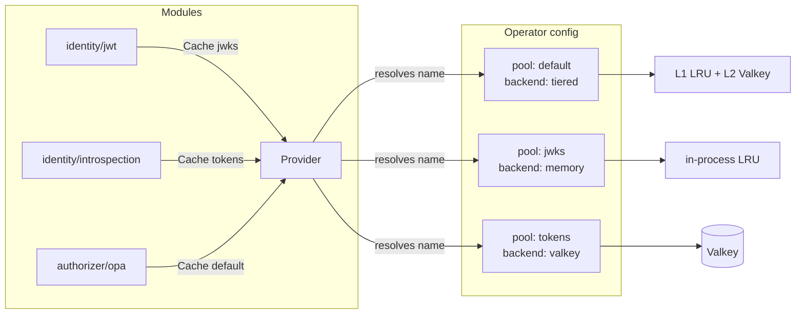

# Cache Layer Redesign — Modular, Pluggable, Module-Native

> Status: **Accepted (all decisions locked)** · Supersedes the backend-selection
> model in [cache-architecture.md](./cache-architecture.md) · Breaking change
> (gated behind a major/minor bump) · **P1+P2+P3+P4 implemented; P5 done (JWKS consolidation + replay migration + valkey pool port + decision-cache pool-routing); P6 done (revocation storage on a pool behind the Store facade)**
>
> **Locked decisions** (see §11, §13):
> 1. DI via a breaking `Deps` parameter on `ModuleFactory` (+ `*Simple` shims).
> 2. First implementation ships `Locker`, `Atomic`, and `TagInvalidator`.
> 3. The shared layer **absorbs** `pkg/revocation` and the `idjag` jti map.
> 4. An undeclared pool name **fails fast at config load** (`ErrConfig`).
> 5. PII to a shared backend is **deny-by-default**: per-pool `allowPII`,
>    `Signed` always on, `Encrypted` opt-in.
> 6. Default codec is **gob**; JSON is opt-in per pool.
> 7. JWKS: **Option A** — keep jwx as the refresh engine, dedup one cache per
>    issuer URL per process, bind the poller to `Deps.Ctx` (fixes the leak),
>    and add an optional L2 read-through (see §12).
> 8. TTL: **module owns all TTLs**, pool provides a `maxTtl` ceiling;
>    `effectiveTTL = min(module.ttl, pool.maxTtl)` (see §6).
> 9. Metrics: **per-pool** evictions/size, **per-call** hits/misses labeled
>    `{pool, module, layer}`; not per logical name (see §6).

## 1. Motivation

Today caching is **outside** the module contract and **reinvented per module**:

| Module | How it caches today | Problem |
|--------|---------------------|---------|
| `jwt` | private `jwx.Cache` | not shareable across replicas, separate refresh logic |
| `introspection` | hand-rolled 3× `internal/cache.LRU` (positive/negative/error) | duplicated TTL + key-hashing logic, pod-local only |
| decision step | `internal/cache.Decision` (tiered, DistSF, tags) | only the pipeline can use it; modules can't |
| third-party modules | nothing | no cache primitive is exported at all |

Two structural limits cause this:

1. **The cache interface lives in `internal/cache`** — it is invisible to
   `pkg/module` and to any out-of-tree module or backend.
2. **Module factories receive no dependencies** — the signature is
   `func(name string, cfg map[string]any) (T, error)`. A module physically
   cannot be handed a cache, so it builds its own.

### Goal

> Make caching a **first-class, injected capability** of every core module
> (identity, authorizer, mutator). Expose **one generic cache interface**
> that the runtime satisfies with a default Valkey-backed implementation,
> and that operators or third parties can re-implement for any store
> (Redis, Memcached, DynamoDB, in-memory, ...). Valkey becomes *one
> registered cache backend among many*, not a hard-wired dependency.

---

## 2. Design Principles

1. **Public, minimal core interface.** A 3-method `Cache` (`Get/Set/Delete`)
   in a new public package `pkg/cache`. Everything else is an optional
   capability interface a backend *may* add.
2. **Capabilities via interface assertion, not a fat interface.** Valkey
   exposes locking, tag-invalidation, and atomic ops through small optional
   interfaces. Modules type-assert for what they need and degrade
   gracefully when a backend lacks a capability.
3. **Named cache pools, declared by the operator.** Config defines a *list*
   of caches; modules request one by name. This is the "list of caches the
   modules can rely on."
4. **Dependency injection at construction.** Module factories gain a `Deps`
   parameter carrying a `cache.Provider`. (This is the breaking change.)
5. **Namespacing is automatic.** The provider hands each module a handle
   pre-prefixed by `kind/type/instance` so keys never collide.
6. **Backend-agnostic semantics.** TTL, miss vs. error, and "never cache
   upstream errors" are enforced by shared helpers, not by each backend.

---

## 3. Package Layout

```
pkg/cache/                     NEW — public, stable contract
  cache.go        Cache, Provider, Entry, capability interfaces
  typed.go        Typed[T] generic codec wrapper (JSON/gob)
  singleflight.go SingleFlight helper (local + distributed bridge)
  namespace.go    namespaced handle + key hashing
  noop.go         Noop cache (caching disabled)
  registry.go     Backend factory registry (RegisterBackend)

internal/cache/                EXISTING — becomes backend implementations
  lru.go          memory backend (implements pkg/cache.Cache)
  tiered.go       L1+L2 backend (implements pkg/cache.Cache + capabilities)
  decision.go     decision cache → re-expressed as a Typed[Decision] user
  valkey/         valkey backend (implements Cache + Locker + TagInvalidator)
```

Backends keep living in `internal/` for first-party code, but they satisfy
the **public** `pkg/cache` interfaces, so an out-of-tree backend in a user's
own module compiles against the same contract.

---

## 4. The Core Interface (`pkg/cache`)

```go
package cache

// Cache is the generic, backend-agnostic contract every module relies on.
// Implementations MUST be safe for concurrent use.
type Cache interface {
    // Get returns the stored bytes. ok=false is a clean miss; err is
    // reserved for transport/backend failures (never "not found").
    Get(ctx context.Context, key string) (value []byte, ok bool, err error)

    // Set stores value under key for ttl. ttl<=0 means "no expiry; rely on
    // the backend's eviction policy".
    Set(ctx context.Context, key string, value []byte, ttl time.Duration) error

    // Delete removes key. Missing keys are not an error.
    Delete(ctx context.Context, key string) error
}
```

That is the entire mandatory surface — identical to today's `Backend`, but
**public**.

### 4.1 Optional capability interfaces

A backend advertises richer behavior by implementing these. Valkey
implements all three; the memory backend implements `TagInvalidator` and
`Atomic` (its atomics run under a single process mutex, so they are correct
for one replica) but not `Locker`, which is inherently cross-replica.

```go
// Locker provides cross-replica mutual exclusion, enabling distributed
// singleflight. Backed by Valkey SET NX PX + token-checked release.
type Locker interface {
    TryLock(ctx context.Context, key string, ttl time.Duration) (token string, acquired bool, err error)
    Unlock(ctx context.Context, key, token string) error
}

// TagInvalidator allows dropping many entries by a logical tag
// (e.g. invalidate every cached decision for sub=alice on logout).
type TagInvalidator interface {
    Tag(ctx context.Context, key string, tags ...string) error
    InvalidateTag(ctx context.Context, tag string) (int, error)
}

// Atomic exposes compare-and-set style primitives for counters and
// idempotency keys (e.g. idjag jti single-use, rate-limit windows).
type Atomic interface {
    SetNX(ctx context.Context, key string, value []byte, ttl time.Duration) (bool, error)
    Incr(ctx context.Context, key string, ttl time.Duration) (int64, error)
}
```

Module usage pattern:

```go
c := deps.Caches.Cache("introspection")        // always a Cache
if locker, ok := c.(cache.Locker); ok {         // opportunistic capability
    // coordinate a distributed refresh
}
```

This is exactly "Valkey is one of the cache modules that implements
specific methods" — the base interface is universal; the *specific* methods
live behind capability assertions.

### 4.2 Typed wrapper (no per-module marshaling)

Most modules cache structs (claims, decisions, keysets), not bytes. A
generic wrapper removes boilerplate and centralizes the codec:

```go
type Typed[T any] struct {
    c     Cache
    codec Codec // gob by default; JSON opt-in per pool
}

func NewTyped[T any](c Cache, codec Codec) *Typed[T]

func (t *Typed[T]) Get(ctx, key) (T, bool, error)
func (t *Typed[T]) Set(ctx, key, v T, ttl time.Duration) error
```

Introspection's three caches collapse to:

```go
positive := cache.NewTyped[Claims](deps.Caches.Cache("introspection.positive"), cache.Gob)
negative := cache.NewTyped[struct{}](deps.Caches.Cache("introspection.negative"), cache.Gob)
```

> **Codec = gob (default).** Compact and Go-native, which suits an internal
> cache where every reader/writer is lwauth itself. Operators who need
> cross-language readers or wire-debuggability set `codec: json` on the pool.
> The codec is a **pool-level** setting so a single backend can't be read
> with mismatched encodings.

---

## 5. The Provider — "a list of caches modules can rely on"

The runtime gives each module a `Provider`. The module asks for a cache by
**logical name**; the provider resolves it to a configured pool, applies
namespacing, and attaches metrics.

```go
// Provider hands out namespaced caches to modules. The runtime builds one
// Provider per pipeline instance and passes it through Deps.
type Provider interface {
    // Cache returns a namespaced handle for a logical name. The name maps
    // to a configured pool (see §6). An undeclared pool name is a
    // configuration error surfaced at load time (see ValidatePools), so
    // Cache itself never has to fail: by the time a module calls it, the
    // pool is guaranteed to exist. The returned handle is auto-prefixed by
    // the requesting module's identity, so two modules using name "tokens"
    // never collide.
    Cache(name string) Cache

    // Names lists the configured cache pools, for diagnostics
    // (lwauthctl caches, /debug surface).
    Names() []string
}
```

> **Unknown pool = fail fast.** Pool references are validated once at config
> load (`ValidatePools`): the loader collects every `cache.pool` named by
> every module and rejects the config with `ErrConfig` if any is missing
> from the `caches:` list. A typo blocks the *new* config from being
> applied — but because lwauth hot-reloads atomically (the running engine is
> only swapped on success), the live node keeps serving on its last-good
> config rather than crashing. This gives strictness without an availability
> cliff.

The provider closes over the calling module's identity (kind/type/instance),
which it supplies during construction, so every key written by
`identity/jwt/my-jwt` is transparently prefixed
`i/jwt/my-jwt/<logical>/<key>`.



---

## 6. Configuration

A new top-level `caches:` block declares the *list* of pools. Each pool
selects a backend by registered type. Modules reference a pool by name via
their existing `cache:` field (now just a pool name + per-module TTLs).

```yaml
caches:
  - name: default
    backend: tiered
    l1: { type: memory, size: 100000 }
    l2:
      type: valkey
      addr: valkey-master.cache.svc:6379
      tls: true
      keyPrefix: lwauth/
  - name: jwks
    backend: memory
    size: 2000
  - name: tokens            # introspection / id-jag replay / revocation
    backend: valkey
    addr: valkey-master.cache.svc:6379
    keyPrefix: lwauth/tok/
    allowPII: false         # default; rejects struct caches carrying claims

# A module picks a pool and sets its own TTLs:
identify:
  - name: my-introspection
    type: introspection
    cache:
      pool: tokens          # <- references the list above
      positiveTtl: 5m
      negativeTtl: 30s
      errorTtl: 5s
```

Backwards-friendly defaults:

- No `caches:` block → an implicit `default` pool of `backend: memory`.
- A module with no `cache.pool` → uses `default`.
- The legacy decision-cache config maps onto a synthesized `default` pool,
  so existing AuthConfigs keep working through one deprecation cycle.

### TTL ownership: module wins, pool caps

A pool declares **infrastructure only** (backend, addr, tls, keyPrefix,
l1 size, allowPII, encrypt, codec) plus one optional governance knob,
`maxTtl`. Every TTL-shaped policy value (`positiveTtl`, `negativeTtl`,
`errorTtl`, `maxStaleness`) lives on the **module**, because the correct
lifetime is a property of the *data*, not the *store*: introspection TTL is
`min(token.exp - now, max)`, id-jag replay TTL is the assertion's remaining
life, revocation TTL is hours. One shared `tokens` pool backs all three, so
the pool cannot dictate a single TTL.

The pool's `maxTtl` is a **ceiling**, not a value — it lets the operator cap
how long anything may persist in a shared/multi-replica backend (e.g. a
revocation-propagation budget). The rule:

```
effectiveTTL = min(module.ttl, pool.maxTtl)     // pool.maxTtl absent ⇒ no cap
```

If the module omits a TTL it falls back to the module's built-in default,
then is still clamped by `maxTtl`. No cross-module conflict arises: each
`Set` carries its own TTL and the backend stores TTL per key, so a 5m
introspection entry and a 24h revocation entry coexist in one pool.

```yaml
caches:
  - name: tokens
    backend: valkey
    maxTtl: 1h            # ceiling for everything in this pool
identify:
  - { name: intro-A, type: introspection, cache: { pool: tokens, positiveTtl: 5m } }   # → 5m
  - { name: intro-B, type: introspection, cache: { pool: tokens, positiveTtl: 24h } }  # → 1h (clamped)
  - { name: intro-C, type: introspection, cache: { pool: tokens } }                    # → module default, clamped
```

### Metrics granularity: per-pool capacity, per-call `{pool, module, layer}`

Evictions are a backend-global capacity event (LRU evicts across the whole
L1 regardless of which module wrote the victim), so they are counted
**per pool**. Hits/misses/stale-served are per-call and carry a `module`
label. Logical names are intentionally **not** a metric dimension to bound
cardinality.

| Metric | Granularity | Labels |
|--------|-------------|--------|
| `lwauth_cache_hits_total` | per call | `pool`, `module`, `layer` |
| `lwauth_cache_misses_total` | per call | `pool`, `module`, `layer` |
| `lwauth_cache_stale_served_total` | per call | `pool`, `module` |
| `lwauth_cache_evictions_total` | per pool | `pool` |
| `lwauth_cache_entries` (gauge) | per pool | `pool`, `layer` |

Cardinality stays bounded: `pools(~3–5) × modules(dozens) × layers(2)`. Adding
logical names (potentially hundreds across AuthConfigs) would explode the
series count, so positive/negative splits are left to an opt-in debug view.

### Backend registry (public)

`pkg/cache.RegisterBackend` replaces `internal/cache.RegisterBackend`, so an
out-of-tree backend registers identically to a built-in:

```go
func RegisterBackend(typeName string, f BackendFactory)
type BackendFactory func(spec BackendSpec, stats *Stats) (Cache, error)
```

`memory`, `tiered`, and `valkey` register in their package `init()` exactly
as backends do today.

---

## 7. Dependency Injection (the breaking change)

### 7.1 Factory signature

```go
// BEFORE
type ModuleFactory[T any] func(name string, cfg map[string]any) (T, error)

// AFTER
type ModuleFactory[T any] func(name string, cfg map[string]any, deps Deps) (T, error)

// Deps carries runtime capabilities the host injects into every module.
type Deps struct {
    Caches  cache.Provider
    Logger  *slog.Logger

    // Ctx is the engine-lifecycle context. Modules that start background
    // goroutines (JWKS pollers, refreshers) MUST bind them to Ctx so they
    // are cancelled when the engine is swapped on hot-reload. This closes
    // the current leak where jwx.Cache pollers use context.Background().
    Ctx context.Context
    // future, additive: Metrics, Clock, Tracer, Secrets — never breaking again
}
```

`Deps` is a **struct**, so future capabilities are added as fields without
re-breaking the signature. This is the one-time cost the user pre-approved.

### 7.2 Migration shim (keeps the diff bounded)

> **Implemented (Phase 2).** Rather than rename the call that all ~28 module
> `init()`s use, the legacy `Register{Identifier,Authorizer,Mutator}` keep
> their **no-deps** signature and now delegate to a generic
> `Registry.RegisterSimple`, which adapts a legacy factory to a deps-aware
> one by discarding `Deps`. Deps-aware modules register with the new
> `Register{Identifier,Authorizer,Mutator}WithDeps`. This made Phase 2
> non-breaking for every existing module while still threading `Deps`
> through `Registry.Build`.

```go
// SimpleFactory is the legacy no-deps signature; ModuleFactory is deps-aware.
type SimpleFactory[T any] func(name string, cfg map[string]any) (T, error)
type ModuleFactory[T any] func(name string, cfg map[string]any, deps Deps) (T, error)

// RegisterSimple adapts a legacy factory; existing init()s are unchanged.
func (r *Registry[T]) RegisterSimple(typeName string, f SimpleFactory[T]) {
    r.Register(typeName, func(n string, c map[string]any, _ Deps) (T, error) {
        return f(n, c)
    })
}
```

Migration order: `jwt` and `introspection` first (they benefit most),
then the rest, then delete the shim.

### 7.3 Alternative considered — post-construction injection

A non-breaking option is an optional interface:

```go
type CacheConsumer interface { UseCaches(p cache.Provider) }
```

The host calls `UseCaches` after `Build`. **Rejected** as the default: it
creates a two-phase, partially-initialized object (cache nil between
`Build` and `UseCaches`), forces nil-checks on the hot path, and hides the
dependency from the type system. We keep `CacheConsumer` only as an
*escape hatch* for modules that genuinely construct lazily.

---

## 8. What Moves Where

| Concern | Today | After |
|---------|-------|-------|
| `Cache`/`Backend` interface | `internal/cache.Backend` | `pkg/cache.Cache` (public) |
| Backend registry | `internal/cache` | `pkg/cache` (public) |
| memory / tiered / valkey | `internal/cache*` | unchanged location, implement `pkg/cache.Cache` |
| JWKS caching | private `jwx.Cache` in `jwt`/`idjag`/`oauth2` | **Option A** (§12): keep jwx for refresh, dedup per issuer, optional shared L2 |
| Introspection 3× LRU | private in module | `Typed[...]` over `Cache("tokens")` |
| Decision cache | `internal/cache.Decision` | a `Typed[Decision]` helper any authorizer can reuse |
| DistSF / tags | `internal/cache` | exposed via `Locker` / `TagInvalidator` capabilities |
| jti replay (idjag) | in-process map | `Atomic.SetNX` over `Cache("tokens")` (now multi-replica) |
| revocation store | separate `pkg/revocation` | **unified**: re-expressed on `pkg/cache` (`Atomic.SetNX` writes, `Cache.Get` checks); keeps its negcache as an L1 pool |

Note the bonus: the `idjag` replay guard and revocation ride the same
pluggable layer, replacing today's pod-local map with a shared store and
giving revocation a uniform backend story.

### 8.1 Folding in `pkg/revocation`

`pkg/revocation` today has its own `Store` (memory/valkey), `NegCache`, and
`ParallelChecker`. Under the redesign:

- `Store.Exists` → `Cache.Get` on a `revocation`-named pool (a present key
  means revoked). `Store.Add` → `Set` with the entry TTL.
- `NegCache` (the local negative-result cache that avoids a network hop on
  the common "not revoked" path) becomes the **L1 of a tiered pool** — the
  same read-through machinery, not a bespoke wrapper.
- `ParallelChecker.ExistsAny` becomes a small helper over `Cache` (still a
  bounded errgroup), unchanged in behavior.
- The `revocation.Store` interface is **retained as a thin facade** over the
  pool so existing call sites and the eventbus-driven `Evict` API keep
  compiling; it just delegates to `pkg/cache` instead of owning storage.

This preserves revocation's immediate-enforcement guarantee (L1 evict on
`Add`) while removing the duplicate backend/connection code.

---

## 9. Security Properties

- **Value signing (always on).** The decision cache's per-instance HMAC
  signing of cached values (so a compromised Valkey can't inject `allow`)
  becomes a reusable `cache.Signed` wrapper applied to **every** pool by
  default, not opt-in.
- **Key hashing.** `Provider` hashes/derives keys so raw tokens never reach
  a backend; the `namespace` helper enforces `sha256` on credential-derived
  keys.
- **Never cache upstream errors.** Encoded in the `Typed`/singleflight
  helpers, not left to each backend.
- **PII to a shared backend = deny by default.** A pool is `allowPII: false`
  unless explicitly set. The `Typed[T]` writer inspects whether the pool
  permits PII before writing a struct cache to a non-local backend; a
  violation is a construction-time `ErrConfig`, not a silent runtime leak.
  When PII *is* required in L2 (e.g. sharing introspection claims across a
  large fleet), the operator sets `allowPII: true` **and** `encrypt: true`,
  which wraps values in `cache.Encrypted` (AES-GCM with a per-tenant key)
  on top of the always-on signing. In-process (`memory`) pools are exempt
  — the value never leaves the address space.

---

## 10. Migration Plan

| Phase | Change | Breaking? | Status |
|-------|--------|-----------|--------|
| P1 | Add `pkg/cache` with `Cache`, `Provider`, capabilities, `Typed`, registry, memory backend. | No | ✅ done |
| P2 | Add `Deps` + deps-aware `ModuleFactory` + `RegisterSimple`/`*WithDeps`; thread `Deps` through `Registry.Build` and the host builder. | No (legacy `Register*` retained) | ✅ done |
| P3 | Add `caches:` config + `Provider` construction in the config loader; build `cache.Pools` and inject a per-module `Deps` (with namespaced `Provider`, engine-lifecycle `Ctx`) into module construction in `Compile()`. | No (defaults preserve behavior) | ✅ done |
| P4 | Migrate `jwt`, `introspection` to injected caches; delete their private caches (JWKS per §12 decision). | No (behavior-compatible) | ✅ done |
| P5 | Migrate remaining modules; route `idjag` replay + decision cache through pools. | No | ✅ done |
| P6 | Fold `pkg/revocation` storage onto a pool behind the retained `Store` facade. | No (facade preserves call sites) | ✅ done |
| P7 | Delete legacy decision-cache config path (and optionally collapse `RegisterSimple`). | Yes (config) | |

P2 landed **non-breaking** by keeping the legacy no-deps `Register*`
functions (now backed by `RegisterSimple`) and adding `*WithDeps` for
deps-aware modules — so the only remaining breaking step is P7's legacy
config removal, bracketed by a deprecation cycle.

P3 landed in the **production compile path** (`config.Compile`), not the
alternate `PipelineBuilder` (which already exposes `WithDeps`). `Compile`
now builds `cache.Pools` from the `caches:` block (`buildCachePools`),
synthesizes the implicit in-memory `default` pool when none are declared,
and constructs a per-module `Deps` via `pools.For(kind+"/"+type+"/"+name, …)`
so identifiers/authorizers/mutators get namespace-isolated handles. Each
module is built through `Build*WithDeps`. The engine-lifecycle `Deps.Ctx`
is a `context.WithCancel` created in `Compile` and handed to the `Engine`
as `Options.LifecycleCancel`; `Engine.Close()` cancels it on hot-reload
swap, so module-owned background goroutines (JWKS pollers in P4) stop with
the engine. The per-module `cache.pool` selector and fail-fast pool-reference
validation (`ValidatePools`) landed alongside P4 (see below).

P4 migrated the two highest-value modules:

- **`introspection`** dropped its three private `internal/cache.LRU`
  instances (positive/negative/error) in favor of injected, namespaced
  handles drawn from `deps.CacheProvider()`:
  `prov.Cache("introspection.positive" | ".negative" | ".error")`. The
  three logical lines share the module's pool backend but keep disjoint
  keyspaces via the provider's auto-prefix. TTLs stay a module concern
  (set per-`Set`). The legacy `cacheSize` config key is still accepted but
  no longer sizes a private cache (the pool owns capacity). The module now
  registers via `RegisterIdentifierWithDeps`.
- **`jwt`** keeps jwx as the JWKS refresh engine but routes acquisition
  through a process-wide registry (`AcquireShared`, originally
  `pkg/identity/jwt/jwks.go`, promoted to the shared `internal/jwks` package
  in P5) that **deduplicates one poller per JWKS URL** and **binds it to
  `Deps.Ctx`** — refcounted so the poller is torn down only when the last
  referencing engine closes. This closes the `context.Background()`
  goroutine leak on hot-reload (§12 Option A, parts (a)+(b)). A no-deps
  build (legacy/tests) still gets a standalone keyset on
  `context.Background()`. The optional L2 read-through (part (c)) remains a
  future enhancement, gated on a configured `jwks` pool.

Deferred out of P4 (tracked for a later phase): porting the valkey backend
into `pkg/cache` so a `tokens`/`jwks` pool can select `backend: valkey`, and
the optional JWKS L2 read-through. Neither is required for the
behavior-compatible default (implicit in-memory pool).

The per-module **`cache.pool` selector** and **fail-fast validation** also
landed with P4. A module routes its caches to a declared pool via a `cache:`
block in its config (`cache: { pool: tokens }`); `config.Compile` owns the
selector — `extractPoolSelector` strips the `cache` key before handing the
config to the module factory (so each module's `CheckUnknownKeys` guard stays
intact) and passes the chosen pool to `pools.For(moduleID, pool, nil)`. Before
any module is constructed, `referencedPools` gathers every selected pool and
`cache.ValidatePools` rejects undeclared references with `ErrConfig` — a
typed pool name fails fast rather than after a half-built engine (module
construction can do network I/O, e.g. the jwt JWKS fetch). The implicit
`default` pool is always selectable without being declared. Per-module TTLs
under `cache:` remain module-parsed today (introspection still reads its
top-level `*Ttl` keys); folding TTLs under `cache:` is a later cleanup.

### P5 (in progress) — shared JWKS registry across modules

P5 began by promoting the JWKS registry from a `jwt`-private implementation to
the shared **`internal/jwks`** package, now consumed by both `jwt` and
`idjag`. `jwks.AcquireShared(lifeCtx, url, minRefresh)` keeps exactly **one
jwx poller per JWKS URL per process** — deduplicated *across modules*, so a
deployment where a `jwt` identifier and an `idjag` identifier trust the same
enterprise IdP shares a single background refresher instead of two. The poller
is refcounted and bound to each acquirer's `Deps.Ctx`; it is cancelled only
when the last referencing engine closes (§12 Option A, parts (a)+(b)). A
no-deps build still gets a standalone keyset on `context.Background()` via
`jwks.Standalone`. The package exposes `ErrRegister` (config-class) and
`ErrFetch` (upstream-class) sentinels which each module maps onto its own
`ErrConfig` / `ErrUpstream`.

This also **fixed the `idjag` JWKS goroutine leak**: `idjag` previously built
its keyset with `jwk.NewCache(context.Background())` in a legacy
two-arg factory, leaking a poller on every hot-reload. It now registers via
`RegisterIdentifierWithDeps` and constructs through `newIdentifierWithDeps`,
binding the poller to the engine lifecycle like `jwt`.

**Replay onto the cache layer (decision: option (a) — memory implements
`Atomic`).** The in-memory backend now implements the `Atomic` capability
(`SetNX`/`Incr`) under its single mutex, giving genuine compare-and-set for a
single replica; `Locker` stays remote-only (cross-replica mutual exclusion is
meaningless in-process). `Namespaced` already preserves the richest capability
set, so a namespaced memory handle advertises `TagInvalidator`+`Atomic`. A new
shared **`internal/replay`** facade (`replay.Guard`) unifies single-use
enforcement (§8.1): `Consume(ctx, key, ttl)` uses `cache.Atomic.SetNX` when the
injected handle supports it (cross-replica once the backend is Valkey) and
falls back to an in-process TTL set otherwise. `idjag` now routes jti
single-use through `deps.CacheProvider().Cache("replay")` (namespaced per
module, so the same jti under two identifiers is independent); its standalone
constructor passes a nil cache and gets the in-process fallback, preserving
legacy single-replica behavior. A `SetNX` backend error fails closed
(`ErrUpstream`) rather than silently allowing a replay.

`dpop` (RFC 9449 jti) is migrated the same way: its `internal/cache` LRU is
replaced by `replay.New(deps.CacheProvider().Cache("replay"))`, the factory is
now deps-aware (`RegisterIdentifierWithDeps`) and builds its inner identifier
via `module.BuildIdentifierWithDeps` so the wrapped bearer identifier also
inherits the engine lifecycle context and cache provider. The legacy
`replayCacheSize` key is still accepted but inert (the pool owns capacity).

`saml` (assertion-ID single-use) is migrated **while preserving G9-VULN-07**:
its `assertionReplayCache` is deliberately *fail-closed at capacity* — under a
flood of distinct IDs it rejects new assertions rather than evicting live
entries, which a plain LRU (including the memory backend's `SetNX`) would not
do. So `replay.NewWithLocal(cache, assertionReplayCache)` keeps the bounded
cache as the in-process fallback and only engages the `SetNX` path for a
**genuinely remote** backend, detected via the remote-only `Locker`
capability. Result: the default in-process pool retains the fail-closed
guarantee, and cross-replica enforcement is gained automatically once a Valkey
pool is configured. The TTL is the assertion's own `NotOnOrAfter`+skew. `saml`
keeps a 2-arg `factory` builder (so its many white-box tests are untouched) and
registers a thin `factoryWithDeps` wrapper that re-wires the guard.

Still open in P5:

- **Valkey backend ported into the pool registry (done).** The Valkey backend
  under `internal/cache/valkey` now also satisfies the public `pkg/cache`
  contract and registers itself with `pkgcache.RegisterBackend("valkey", …)` on
  import (pkg/cache stays stdlib-only; the bridge lives in `internal/`). Its
  `*Backend` already matched `pkgcache.Cache` (Get/Set/Delete); the port adds
  the optional capabilities — `Locker` (SET NX PX + token-checked Lua unlock),
  `Atomic` (`SetNX`, and `Incr` via an INCR+conditional-PEXPIRE Lua script so
  TTL is applied only on counter creation), and `TagInvalidator` (SADD
  membership sets, per-member DEL on invalidation to stay cluster-slot safe).
  A pool configured `backend: valkey` therefore exposes the full capability set
  to modules — so the replay guard's cross-replica `SetNX` path and the
  decision cache's distributed singleflight `Locker` both light up the moment a
  Valkey pool is wired. miniredis-backed tests cover round-trip, locker
  ownership, SetNX/Incr semantics, tag invalidation, and the namespaced handle.

- **Decision cache through pools (done, opt-in).** A new `cache.pool` selector
  on the module-level `cache:` block draws the decision cache's backend from a
  declared pool instead of the inline `backend`/`addr`/`tiered`/
  `distributedSingleflight` fields. The loader resolves the pool via
  `pools.For("decision", spec.Pool, nil).Cache("decisions")` and feeds the
  resulting `pkgcache.Cache` straight into the new
  `cache.NewDecisionWithBackend(opts, backend, stats)` constructor — the
  decision cache's `Backend` interface is structurally identical to
  `pkgcache.Cache` (Get/Set/Delete), so no adapter is needed. `NewDecision`
  now delegates to it after building the inline backend, so both paths share
  one code path. The change is **non-breaking**: an empty `cache.pool`
  preserves 100% of existing behaviour. Guards:
  - `cache.pool` is **mutually exclusive** with the inline backend fields
    (`backend`/`addr`/`distributedSingleflight`) — combining them is
    `ErrConfig`. The pool owns backend infrastructure.
  - A `cache.pool` that names an undeclared pool fails fast through
    `referencedPools`/`ValidatePools` at load time (`ErrConfig`).
  - **Tenant-key validation is preserved** unchanged in the loader: a
    decision cache on a tenant-scoped module still requires `tenant` in its
    key fields.
  Caveats for the pool path: the **tiered (L1+valkey L2)** and **DistSF**
  topologies remain on the inline (non-pool) path by design this iteration — a
  pool exposes a single backend, not a composed tier. Tag membership for a
  pool-routed backend is **delegated to the backend** (Option A): when the
  backend implements `TagInvalidator` (the pkg/cache memory and valkey pool
  backends do), the decision cache calls `backend.Tag` on store and
  `backend.InvalidateTag` on invalidation instead of the in-process `tagIndex`.
  This closes the previous `tagIndex` leak — the backend's own eviction/expiry
  reclaims membership sets — and makes `InvalidateByTags` take effect across
  every replica sharing a valkey pool. The in-process `tagIndex` (+ `*LRU`
  eviction → `tagIndex.Remove` hook) is retained as the fallback for the inline
  LRU/Tiered backends, which do not implement `TagInvalidator`.
  miniredis/memory-backed tests cover allow/deny caching, upstream-error
  non-caching, nil-backend rejection, delegated tag invalidation, and the
  loader guards.

P6 — revocation storage on a pool (done):

- **Revocation store through pools.** A new `revocation.pool` selector folds the
  revocation store's storage onto a declared pool behind the retained
  `revocation.Store` facade, so every call site (admin `Add`, pipeline
  `Exists`, `Remove`) is unchanged. The loader resolves the pool via
  `pools.For("revocation", spec.Pool, nil).Cache("revocations")` and wraps the
  resulting backend in `revocation.NewCacheStore(cache, defaultTTL)`. To avoid
  importing `pkg/cache` into `pkg/revocation`, `CacheStore` depends on a local
  `revocation.Cache` interface that is a structural subset of `pkgcache.Cache`
  (Get/Set/Delete) — the config layer bridges the two. `Add`→`Set` (with TTL),
  `Exists`→`Get`, `Remove`→`Delete`. As with the other pool paths it is
  **opt-in and non-breaking**, and **mutually exclusive** with the inline
  `backend`/`addr` fields (`ErrConfig`); an undeclared pool fails fast via
  `referencedPools`/`ValidatePools`. The pool-backed store is wrapped in the
  existing `NegCache` (a pool is shared/remote infrastructure, so the negative
  cache spares the hot path a round-trip on the common not-revoked case; `Add`
  evicts the local entry so revoke-then-check stays correct).
  - **`List` is unsupported** on a pool-backed store: the `pkg/cache` contract
    is a flat key-value store with no SCAN/enumeration, so `List` returns
    `revocation.ErrListUnsupported`. Deployments that need to enumerate active
    revocations should use the dedicated `backend: valkey` path, which scans.
    `Add`/`Exists`/`Remove` — the hot-path and admin-revoke operations — are
    fully supported.
  Tests cover Add/Exists/Remove round-trip, TTL expiry, `List` rejection, the
  `Store`/`NegCache` interface satisfaction, and the loader guards (build,
  undeclared pool, pool+backend conflict).


---

## 11. Resolved Decisions & Remaining Questions

**Resolved** (this iteration):

| # | Decision |
|---|----------|
| DI | Breaking `Deps` parameter on `ModuleFactory`; `*Simple` shims for staged migration. |
| Capabilities | Ship `Locker`, `Atomic`, `TagInvalidator` in v1. |
| Revocation/replay | Unify both onto `pkg/cache` (§8.1); keep a thin `Store` facade. |
| Unknown pool | Fail fast at config load (`ErrConfig`); live node keeps last-good config. |
| PII | Deny-by-default per pool; `allowPII` + `encrypt` to permit; signing always on. |
| Codec | gob default, `codec: json` opt-in per pool. |
| TTL precedence | Module owns all TTLs; pool sets backend + `maxTtl` ceiling; `effectiveTTL = min(module.ttl, pool.maxTtl)` (§6). |
| Stats granularity | Per-pool evictions/size; per-call hits/misses labeled `{pool, module, layer}`; not per logical name (§6). |
| JWKS | Option A — keep jwx for refresh, dedup per issuer URL, bind poller to `Deps.Ctx`, optional L2 read-through (§12). |

All design questions are now resolved; the document is ready for Phase 1
implementation (`pkg/cache`).

---

## 12. JWKS Deep-Dive (decided: Option A)

### How it works today (`jwt`, mirrored in `idjag` and `oauth2`)

```go
cache  := jwk.NewCache(ctx)                                  // background poller goroutine
cache.Register(jwksURL, jwk.WithMinRefreshInterval(15*min))  // floor; honors Cache-Control
cache.Refresh(refreshCtx, jwksURL)                           // blocking initial fetch, 30s timeout
keyset := jwk.NewCachedSet(cache, jwksURL)                   // live, lock-free read view
opts   := []ParseOption{ WithKeySet(keyset), WithRequiredClaim("exp"), ... }
```

- **Hot path** (`Identify`) verifies signatures against the in-memory
  keyset — no network call. A `kid` miss fails verification; the background
  poller (not the request) is what brings in rotated keys.
- **Background refresher** refetches per `Cache-Control: max-age` (floored
  at 15m), using **conditional GET** (`If-None-Match` → `304`), then
  **atomically swaps** the keyset.
- `refresh_tracker.go` rate-limits any kid-miss-triggered force refresh (5s
  floor) and emits `keyrotation` metrics.

### Properties & current limitations

| Property | Today |
|----------|-------|
| Shared across replicas | No — every pod polls (fine: JWKS is tiny, CDN-backed, 304s) |
| Per-instance dedup | None — each module instance builds its own cache + poller for the same URL |
| Unified metrics/config | No — separate `keyrotation` path, off `cache.Layer` |
| Goroutine lifecycle | **Leak**: factory passes `context.Background()`, so hot-reload leaks the old poller |

### Options

| | A — Keep jwx, optional L2 (recommended) | B — Replace with `Typed[jwk.Set]` over a pool | C — Leave as-is |
|---|---|---|---|
| Refresh / 304 / kid handling | jwx (battle-tested) | reimplement ourselves | jwx |
| Multi-replica sharing | optional read-through L2 for big fleets | yes, by default | no |
| Goroutine leak fixed | yes (bind to `Deps.Ctx`) | yes | no |
| Per-process dedup | yes (one cache per issuer URL) | yes | no |
| Reimplementation risk to signature verification | none | **real** (stale keys, rotation stampede, 304 bugs) | none |
| Uniformity with the rest of the layer | partial | full | none |

**Decision: Option A.** JWKS is the one cache where pod-local + jwx's
HTTP semantics are the right tool, and it's signature-verification-critical,
so reimplementation risk (B) outweighs the marginal L2 win that only appears
at 500+ pods. Adopt the unified layer everywhere else; for JWKS keep jwx as
the refresh engine but (a) dedup to one cache per issuer URL per process,
(b) bind the poller to `Deps.Ctx` to kill the leak, and (c) add an optional
L2 read-through gated on a `jwks` pool being configured.

---

## 13. Summary

- One **public** `pkg/cache.Cache` interface; Valkey/memory/tiered are just
  registered backends behind it.
- **Optional capability interfaces** (`Locker`, `TagInvalidator`, `Atomic`)
  let Valkey expose specific methods without bloating the core contract.
- A **`Provider`** injected via **`Deps`** gives every identity/authorizer/
  mutator module a namespaced cache it can rely on.
- Operators declare a **list of named cache pools**; modules pick one.
- Module-private, duplicated caching (`jwt`, `introspection`) collapses onto
  the shared layer, and replay/revocation gain multi-replica sharing.
- The only hard breaking change is the one-time factory signature, absorbed
  by a `Deps` struct that never needs to break again.
```
